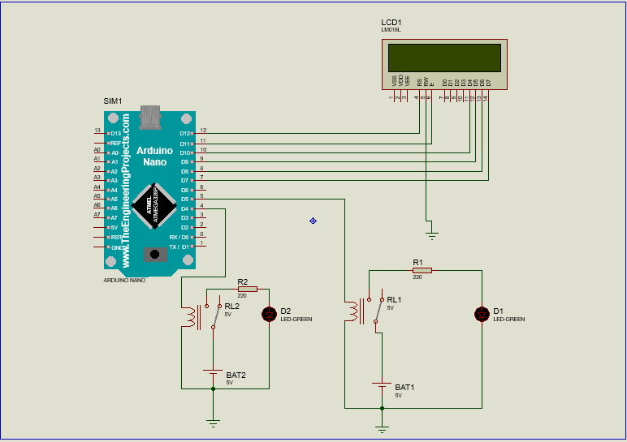
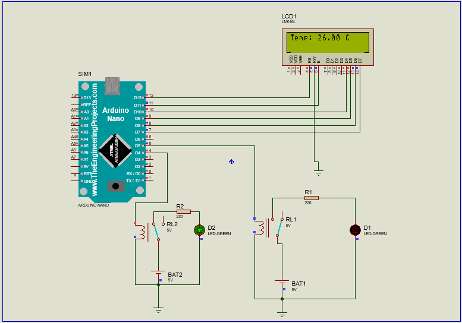

<h1>#RTOS </h1>

<h2>1. Introdução ao RTOS</h2>

Um Sistema Operativo em Tempo Real (RTOS da sigla Real Time Operating System) é um sistema operacional/operativo destinado à execução de múltiplas tarefas onde o tempo de resposta a um evento (externo ou interno) é pré-definido; não importando, como é comum pensar-se, se a velocidade de resposta é elevada ou não. Esse tempo de resposta é chamado de prazo da tarefa e a perda de um prazo, isto é, o não cumprimento de uma tarefa dentro do prazo esperado, caracteriza uma falha do sistema. Outra característica dos sistemas de tempo real é a sua interação com o meio ao redor. Os STR (Sistemas de Tempo Real) tem que reagir, dentro de um prazo pré-definido, a um estímulo do meio.
 

<h2>2. Multitarefa com FreeRTOS</h2>

O FreeRTOS, oferece alguns mecanismos de comunicação entre tarefas. Como tanto o controle dos mecanismos de comunicação quanto o chaveamento entre as tarefas são controladas pelo sistema operacional, este consegue garantir que nenhuma tarefa seja interrompida de forma a deixar dados inconsistentes.

O FreeRTOS oferece alguns mecanismos que permitem realizar comunicação entre tarefas de forma thread safe tais como:

    Notificações
    Filas
    Semáforos
    Mutexes
    

A escolha de um dos tipos de comunicação acima depende da aplicação.

<h2>3. Sincronização de tarefas</h2>

Podemos ter várias tarefas usando um mesmo recurso, como um periférico, entretanto, ele só pode fazer uma coisa por vez. E isso gera problemas de concorrência, quando duas ou mais tarefas precisam do mesmo recurso ao mesmo tempo é importante usar mecanismos de sincronização do FreeRTOS, como semáforos ou mutexes. Esses mecanismos garantem o acesso exclusivo aos recursos compartilhados, evitando condições de corrida e garantindo a consistência dos dados. A herança de prioridade é uma implementação do FreeRTOS que aumenta a prioridade da tarefa que está usando o semáforo quando é interrompida por outra tarefa que também está tentando usar o semáforo. Isso garante que a tarefa que está usando o semáforo tenha a maior prioridade entre todas as outras que tentarem obtê-lo. Este método tenta minimizar o problema de inversão de prioridades.

<h2>4. Reações baseadas em condições de tempo real</h2>

Para implementar uma reação baseada em tempo real, nessa parte do código, temos uma função chamada TaskBlink2 que é executada como uma tarefa no FreeRTOS.

TaskBlink2, que recebe um ponteiro void como parâmetro (pvParameters). O uso do (void) antes do pvParameters é uma forma de suprimir um aviso de compilador indicando que o parâmetro não está sendo utilizado.

    (void) pvParameters;: Essa linha de código está sendo usada para evitar um aviso do compilador sobre a variável pvParameters não utilizada. Se o parâmetro pvParameters não for necessário na tarefa, é comum fazer essa supressão.

    for(;;): É um loop infinito que garante que a tarefa seja executada continuamente, repetindo o código dentro do loop.

    if (temperature == 26.00): Esta é uma condição que verifica se a variável temperature é igual a 26.00. Dependendo do contexto do código, é possível que a variável temperature seja uma variável global ou seja passada como parâmetro para a função TaskBlink2. Essa condição verifica se a temperatura atingiu o valor desejado (26.00 graus).

    digitalWrite(LED_PIN_2, HIGH);: Se a condição no passo anterior for verdadeira, ou seja, se a temperatura for igual a 26.00, o pino LED_PIN_2 é definido como HIGH (ligado), acendendo o LED conectado a esse pino.

    vTaskDelay(500 / portTICK_PERIOD_MS);: Essa função vTaskDelay() suspende a execução da tarefa por um determinado período de tempo. Nesse caso, a tarefa é suspensa por 500 milissegundos antes de prosseguir para a próxima linha de código.

    digitalWrite(LED_PIN_2, LOW);: Após a suspensão da tarefa, o pino LED_PIN_2 é definido como LOW (desligado), apagando o LED conectado a esse pino.

    vTaskDelay(500 / portTICK_PERIOD_MS);: Outra chamada para vTaskDelay() suspende novamente a execução da tarefa por 500 milissegundos.

Essa sequência de código implementa um comportamento de piscar o LED conectado ao LED_PIN_2 quando a temperatura atingir o valor de 26.00 graus. A tarefa fica em um loop infinito, verificando a condição e alternando o estado do LED com intervalos de 500 milissegundos.

<h2>5. Vantagens</h2>

O uso de um RTOS nas aplicações de IoT traz benefícios essenciais, como gerenciamento eficiente de tarefas, responsividade em tempo real, confiabilidade, utilização eficiente de recursos, modularidade e facilidade de desenvolvimento. Essas vantagens ajudam a criar sistemas IoT mais robustos, escaláveis e confiáveis, permitindo uma implementação eficaz e bem-sucedida das aplicações IoT em diversos domínios.

<h1>#Circuito</h1>

Esquemático do circuito:

Código:

#include <Arduino.h>
#include <Arduino_FreeRTOS.h>
#include <LiquidCrystal.h>
LiquidCrystal lcd(12,11,10,9,8,7);
#define LED_PIN_1 5
#define LED_PIN_2 4

void TaskBlink1(void *pvParameters);
void TaskBlink2(void *pvParameters);
// protótipos para as tarefas
void TaskReadTemperature(void *pvParameters);
// Variável para armazenar a temperatura lida
volatile float temperature = 0.0;
void setup() {
  pinMode(LED_PIN_1, OUTPUT);
xTaskCreate(
  TaskBlink1, //função da tarefa - Ponteiro
  "Blink1",
  128, //tamanho da pilha
  NULL, //Parametro da tarefa
  2, //Prioridade - números mais altos - proporcional a prioridade
  NULL //agendar tarefa
); pinMode(LED_PIN_2, OUTPUT);
xTaskCreate(
  TaskBlink2, 
  "Blink2",
  128, //tamanho da pilha
  NULL, //Parametro da tarefa
  1, //Prioridade - números mais altos - proporcional a prioridade
  NULL //agendar tarefa
);

Serial.begin(9600);
lcd.begin(16,2);
// cria as tarefas
xTaskCreate(
TaskReadTemperature,
"ReadTemperature",
128,
NULL,
3,
NULL );
//Crie as outras tarefas aqui
}
void loop() {
// nada aqui!
}
void TaskBlink1(void *pvParameters){
  (void) pvParameters;
  for(;;){
    digitalWrite(LED_PIN_1, HIGH);
    vTaskDelay(500 / portTICK_PERIOD_MS); //Função milis do RTOS
    digitalWrite(LED_PIN_1, LOW);
    vTaskDelay(500 / portTICK_PERIOD_MS); //Função milis do RTOS
  }
}
void TaskBlink2(void *pvParameters){
  (void) pvParameters;
  for(;;){
    if ( temperature == 26.00)
    {
    
    digitalWrite(LED_PIN_2, HIGH);
    vTaskDelay(500 / portTICK_PERIOD_MS); //Função milis do RTOS
    digitalWrite(LED_PIN_2, LOW);
    vTaskDelay(500 / portTICK_PERIOD_MS); //Função milis do RTOS
  }
}}
void TaskReadTemperature(void *pvParameters) {
(void) pvParameters;
float sensorValue = 0.0;
for (;;) {
// Aqui você normalmente leria o valor do sensor de temperatura.
// Por simplicidade, vamos apenas simular um sensor variando a
//temperatura de -10 a 40.
sensorValue = -10.0 + (rand() % 51); // gera um número aleatório entre
//-10 e 40
temperature = sensorValue;
vTaskDelay(2000 / portTICK_PERIOD_MS); // aguarda por 2 segundos
lcd.setCursor(0,0);
lcd.print("Temp: ");
lcd.print(temperature);
lcd.print(" C");
// vTaskDelay(1000 / portTICK_PERIOD_MS);
}
}